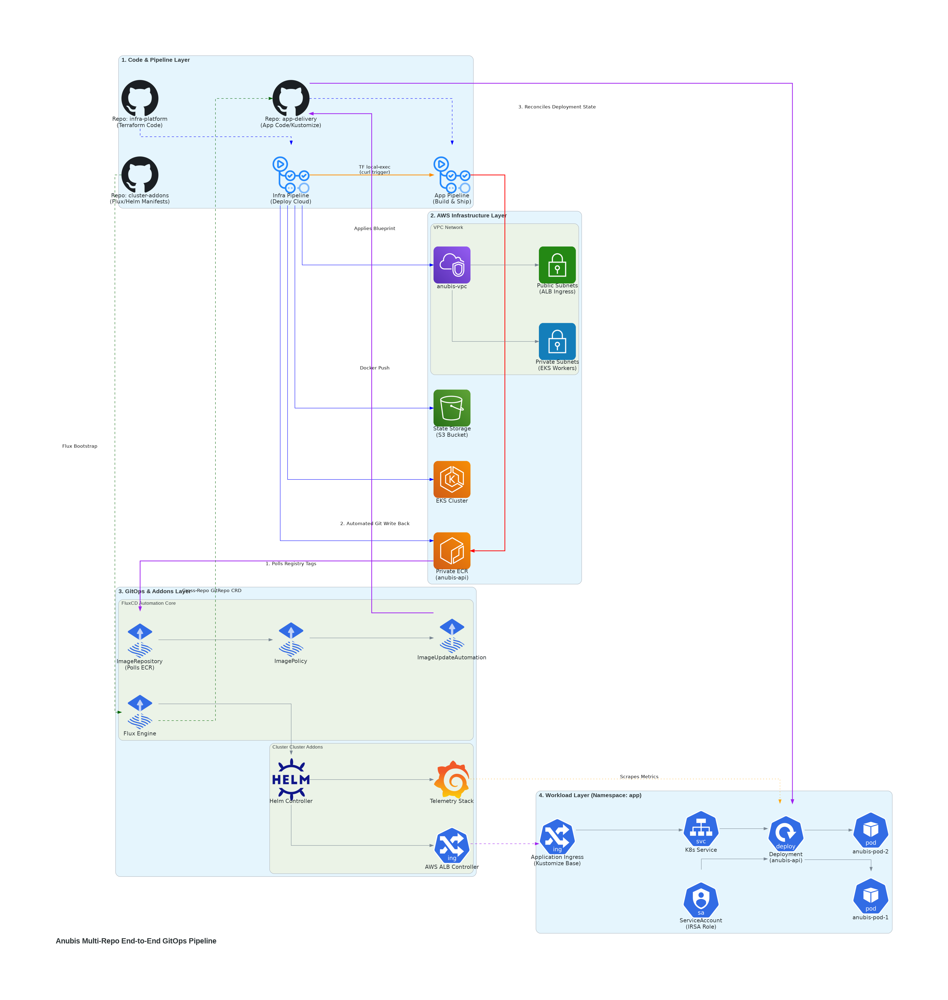

# ANUBIS PLATFORM

This project demonstrates a production-style GitOps platform on AWS. Infrastructure is provisioned using Terraform, Kubernetes workloads are managed through FluxCD and CI/CD pipelines are implemented with GitHub Actions. The platform includes monitoring through Prometheus and Grafana and follows a poly repository architecture that separates infrastructure, platform services, and application deployments.

## REPOSITORY STRUCTURE

Infrastructure, platform configuration, and application deployment are separated into dedicated repositories to reduce coupling and allow independent lifecycle management.

**anubis-infra-platform**
│
├── Terraform
├── VPC
├── EKS
├── IAM
└── ECR

**anubis-cluster-addons**
│
├── Flux Bootstrap
├── ALB Controller
├── Prometheus
├── Grafana
└── GitRepository Definitions

**anubis-app-delivery**
│
├── Python Application
├── Dockerfile
├── Kubernetes Manifests
└── CI/CD Pipeline

***Deployment Workflow***

GitHub Push
      ↓
GitHub Actions
      ↓
Terraform Apply
      ↓
AWS Infrastructure Provisioned
      ↓
Build Docker Image
      ↓
Push Image to ECR
      ↓
Update Kubernetes Manifest
      ↓
Commit Change
      ↓
Flux Reconciliation
      ↓
Deploy to EKS

***Lessons Learned*** 
Initially I attempted to implement Flux Image Automation to fully automate image updates. After extensive evaluation and troubleshooting, I was unable to get Flux to automate images. So I decided to use Terraform to update GitHub Actions. While Flux Image Automation would provide a more complete GitOps workflow, the Terraform approach reduced complexity and allowed me to complete the platform within project timelines.

***Future Improvements***
- Flux Image Automation
- Multi-environment promotion strategy
- Helm-based application deployments
- External Secrets integration
- Cluster autoscaling
- Disaster recovery testing
